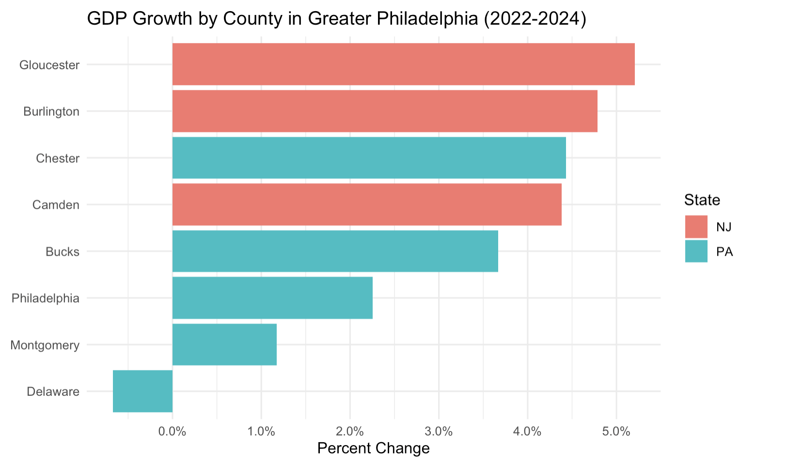
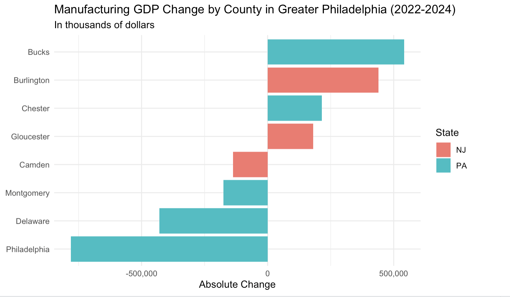
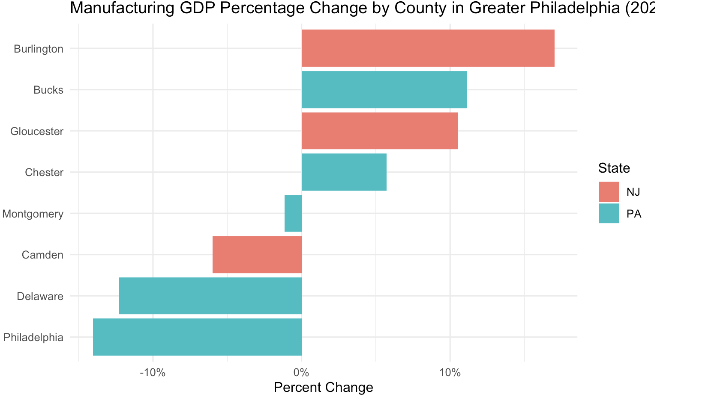

# Pitch Memo

## In two sentences, what is this story about?

Delaware County is the only county in the greater Philadelphia region
whose GDP shrank between 2022 and 2024. Manufacturing industry in
Delaware County lost more than \$428 million in output, showing a 12%
decline. Meanwhile, neighboring counties like Bucks and Burlington saw
their manufacturing GDP grow by double digits over the same period.



## In one sentence, why tell this story NOW?

The Bureau of Economic Analysis (BEA) released its 2024 county-level GDP
data on February 5, 2026, offering the most current picture of how the
greater Philadelphia region's economy has shifted.

## Who is your target audience?

Residents and workers in Delaware County and the greater Philadelphia
region

## Three people you can interview for this story

1.  Still finding actual person: An economist at the Federal Reserve
    Bank of Philadelphia specializing in regional labor markets, who
    could provide context on the broader manufacturing decline across
    southeastern Pennsylvania.
2.  [Brian C. Eury](https://www.delcopa.org/ida), Chair of Delaware
    County Industrial Development Authority, who could speak to what
    industries the county has tried to attract and whether any economic
    diversification strategies are underway. (610) 566-2225
3.  A representative from the [Delaware County Central Labor Council,
    AFL-CIO](https://paaflcio.org/delaware-county-afl-cio-council/about-us),
    (maybe Todd Farally the President? but I haven't find his direct
    contact info), who could speak to job losses across the county's
    manufacturing sector

## Potential impact

A sustained decline in Delaware County's manufacturing output likely
means fewer stable jobs for working-class residents, reduced tax revenue
for local services, and a widening gap between the county and its
neighbors.

## What are three things that surprised or interested you about this story?

1.  Delaware County's GDP shrank even as personal income grew by 10%.
    Residents may be earning more by commuting to jobs elsewhere. ~~(How
    to explore this with data?)~~

**this headline needs to be fixed – it bleeds off the page – and the
screenshot needs cropping on the top**


2.  Philadelphia's manufacturing sector actually fell harder than
    Delaware County's (14% vs. 12%), but Philadelphia's overall GDP
    remained positive. Delaware County's economy is far more dependent
    on manufacturing and has fewer industries to fill the gap.





3.  Between 2015 and 2025, transportation equipment manufacturing,
    historically the largest employer among all manufacturing
    sub-sectors, lost nearly 1,600 jobs, a 29% decline.

**this chart doesn't illustrate the decline you describe in point #3. so
either revise the chart or the narrative in #3.**

<iframe title="Delaware County&#39;s 10 Largest Manufacturing Sub-sectors by Employment in 2025" aria-label="Bar Chart" id="datawrapper-chart-eIeGS" src="https://datawrapper.dwcdn.net/eIeGS/3/" scrolling="no" frameborder="0" style="border: none;" width="100%" height="500" data-external="1">

</iframe>

<iframe title="Manufacturing Sub-sectors With More Workers in 2025 Compared With 2015" aria-label="Line chart" id="datawrapper-chart-66d8T" src="https://datawrapper.dwcdn.net/66d8T/1/" scrolling="no" frameborder="0" style="border: none;" width="100%" height="500" data-external="1">

**the annotations on this graphic bleed outside of the boundaries so
please revise so all of the wording is visible**

</iframe>

<iframe title="Manufacturing Sub-sectors With Less Workers in 2025 Compared in 2015" aria-label="Line chart" id="datawrapper-chart-H3Flo" src="https://datawrapper.dwcdn.net/H3Flo/1/" scrolling="no" frameborder="0" style="border: none;" width="100%" height="500" data-external="1">

</iframe>

## Context: Summarize any previous coverage.

[WHYY reported in
2023](https://whyy.org/articles/manufacturing-downturn-economy-federal-reserve/)
that the greater Philadelphia region experienced nine consecutive months
of manufacturing slowdown, with factory closures and layoffs in
Philadelphia and King of Prussia.

The Federal Reserve Bank of Philadelphia's [May 2026 Manufacturing
Business Outlook
Survey](https://www.philadelphiafed.org/surveys-and-data/regional-economic-analysis/manufacturing-business-outlook-survey)
found that the employment index remained negative for the third time in
four months, suggesting the region's manufacturing job losses are
ongoing.

According to [Delaware County's official
history](https://delcopa.gov/your-county-glance-history), the county has
a long history as an industrial hub, home to shipbuilders, locomotive
makers, and oil refineries. But the county's manufacturing sector has
been shrinking for decades, and the latest BEA data shows it is still
losing ground. No reporting has specifically asked why Delaware County
has failed to compensate for those losses with growth in other sectors,
or what that means for the workers and communities left behind.

## Photos, video, graphics - How will you make this story visual?

Graphics

## What other information do you need to gather?

- Employment data for Delaware County to understand where workers went
  as manufacturing shrank, and why personal income continued to rise
  despite the GDP decline.
- Population change data would help confirm whether residents are
  leaving the county.
- Any specific factory closures during this period?

## Estimated delivery

Data analysis will be complete by June 7. Interviews will wrap up by
June 15. A first draft will be ready by June 17.

------------------------------------------------------------------------

------------------------------------------------------------------------

------------------------------------------------------------------------

**The following section contains code for reference (work in progress!!!).**

# Code Memo

**Data limitations**

This data series lags significantly. We are working with 2024 data, the most recent available. But it is still the best you can get and you can't beat the price.

## Setup

```{r include=FALSE}
#Load libraries
#install.packages("rio")
library(tidyverse)
library(readxl)
library(janitor)
library(rio)
```

## Regional GDP by County

**Data limitations**

This data series lags significantly. We are working with 2024 data, the most recent available. But it is still the best you can get and you can't beat the price.

<br>

### Retrieve GDP Data

GDP CAGDP1 County gross domestic product (GDP) summary Real Gross Domestic Product (GDP) (Thousands of chained 2017 dollars) Source Page https://www.bea.gov/news/2026/gross-domestic-product-county-and-personal-income-county-2024

And more detail: https://www.bea.gov/data/gdp/gdp-by-county

```{r}
#| include: false
gdp_county <- read_csv("https://raw.githubusercontent.com/djnf-data-2026/master/refs/heads/main/data/bea_gdp_2024_county_CAGDP1.csv", skip=3) |> 
  clean_names() |> 
    mutate(across(3:5, as.numeric))

glimpse(gdp_county)
```

### Calculate change 2024 vs 2022; split out state

```{r}

gdp_county <- gdp_county |> 
  mutate(pct_24_v_22 = (x2024-x2022)/x2022,
          state = str_split_fixed(geo_name, ", ", 2)[, 2],
         county = str_split_fixed(geo_name, ", ", 2)[, 1])  

```

```{r}
philly_gdp <- gdp_county |>
  filter(state == "PA" | state == "NJ") |>
  filter(county %in% c("Philadelphia", "Montgomery", 
                        "Bucks", "Chester", 
                        "Delaware", "Gloucester", 
                        "Camden", "Burlington")) |>
  select(county, state, x2022, x2024, pct_24_v_22) |>
  mutate(rank(x2022)) |>
  mutate(rank(x2024)) |>
  mutate(pct_24_v_22 = round(pct_24_v_22 * 100, 2)) |>
  arrange(desc(pct_24_v_22))

philly_gdp

philly_gdp |>
  select(county, pct_24_v_22) |>
  write.csv("../data/philly_gdp.csv",row.names = FALSE)
```

### Chart: GDP Growth by County

**rsw comment: you'll want this chart at the top of your page**

```{r chart-gdp-growth}
# AI assisted
ggplot(philly_gdp, aes(x = reorder(county, pct_24_v_22), y = pct_24_v_22, fill = state)) +
  geom_col() +
  coord_flip() +
  scale_y_continuous(labels = scales::percent) +
  labs(
    title = "GDP Growth by County in Greater Philadelphia (2022-2024)",
    x = NULL,
    y = "Percent Change",
    fill = "State"
  ) +
  theme_minimal()
```

> **Finding:** Delaware County was the only county in the region to see its GDP shrink between 2022 and 2024.

## Part 2: Personal Income by County

### Load and Clean Data

```{r}
# [Personal income (Thousands of dollars)](https://www.bea.gov/news/2026/gross-domestic-product-county-and-personal-income-county-2024)
# BEA CAINC1 - County Personal Income Summary
# CAINC1 County personal income summary: personal income, population, per capita personal income
cainc1 <- read_csv("../data/bea_gdp_2024_personal_income_county_CAINC1.csv", skip=3) |> 
  clean_names() |> 
  mutate(across(x2022:x2024, as.numeric)) |> 
  mutate(
    pct_23_v_22 = round((x2023 - x2022) / x2022, 4),
    pct_24_v_23 = round((x2024 - x2023) / x2023, 4),
    pct_24_v_22 = round((x2024 - x2022) / x2022, 4)
  )
```

### Filter Greater Philadelphia

```{r}
philly_income <- cainc1 |>
  filter(str_detect(geo_name, "Philadelphia, PA|Montgomery, PA|Bucks, PA|Chester, PA|Delaware, PA|Gloucester, NJ|Camden, NJ|Burlington, NJ")) |>
  select(geo_name, x2022, x2024, pct_24_v_22) |>
  separate(geo_name, into = c("county", "state"), sep = ", ") |>
  arrange(desc(pct_24_v_22))

philly_income
```

### Chart: Personal Income Growth by County

```{r}
# AI assisted
ggplot(philly_income, aes(x = reorder(county, pct_24_v_22), y = pct_24_v_22, fill = state)) +
  geom_col() +
  coord_flip() +
  scale_y_continuous(labels = scales::percent) +
  labs(
    title = "Personal Income Growth by County in Greater Philadelphia (2022-2024)",
    x = NULL,
    y = "Percent Change",
    fill = "State"
  ) +
  theme_minimal()

```

> **Finding:** Personal income in Delaware County grew 10.98% between 2022 and 2024, yet its GDP was the only one in the region to shrink. Residents may be earning more by working elsewhere while local industries are losing ground.

## Part 3: GDP by Industry

### Load and Clean Data

*BEA CAGDP2 — GDP by Industry (Current dollars)* 

```{r}
#| include: false

# Load and Clean Data
# Merge Pennsylvania and New Jersey industry files
gdp_industry <- bind_rows(
  read_csv("../data/CAGDP2_GPD_PA_Industry.csv", skip = 3) |> clean_names(),
  read_csv("../data/CAGDP2_GPD_NJ_Industry.csv", skip = 3) |> clean_names()
)

glimpse(gdp_industry)
```

### Filter Private Industry Sub-sectors for Greater Philadelphia

```{r}
#| include: false
# Using Private industries sub-categories only (excluding aggregates to avoid double counting)
gdp_industry <- gdp_industry |>
 mutate(
  x2022 = as.numeric(x2022),
  x2023 = as.numeric(x2023),
  x2024 = as.numeric(x2024)
)

# AI-assisted
greater_philly_total <- gdp_industry |>
  filter(str_detect(geo_name, "Philadelphia, PA|Montgomery, PA|Bucks, PA|Chester, PA|Delaware, PA|Gloucester, NJ|Camden, NJ|Burlington, NJ")) |>
  filter(line_code == 1) |> 
  select(geo_name, description, x2022, x2023, x2024) |>
  mutate(pct_24_v_22 = round((x2024 - x2022) / x2022, 4)) |>
  arrange(desc(pct_24_v_22))

glimpse(greater_philly_total)

# check what industry included
gdp_industry|>
  distinct(description) |>
  print(n = 36)
```

```{r}
greater_philly_industry <- gdp_industry |>
  filter(str_detect(geo_name, "Philadelphia, PA|Montgomery, PA|Bucks, PA|Chester, PA|Delaware, PA|Gloucester, NJ|Camden, NJ|Burlington, NJ"))  |>
  filter(description %in% c(
    "Agriculture, forestry, fishing and hunting",
    "Mining, quarrying, and oil and gas extraction",
    "Utilities",
    "Construction",
    "Manufacturing",
    "Wholesale trade",
    "Retail trade",
    "Transportation and warehousing",
    "Information",
    "Finance, insurance, real estate, rental, and leasing",
    "Professional and business services",
    "Educational services, health care, and social assistance",
    "Arts, entertainment, recreation, accommodation, and food services",
    "Other services (except government and government enterprises)"
  )) |>
  select(geo_name, description, x2022, x2024) |>
  mutate(pct_24_v_22 = round((x2024 - x2022) / x2022, 4)) |>
  mutate(x24_v_22 = x2024 - x2022) |>
  arrange(desc(x24_v_22))

glimpse(greater_philly_industry)
```

### Top 10 Industries with Largest Decline Across the Region

```{r}
greater_philly_industry |>
  slice_min(x24_v_22, n = 10)
```

> **Finding:** Delaware County's manufacturing sector ranks third on the list, which likely explains why it is the only county in the region with negative GDP growth. I decide to have a closer look at Delaware County's industry breakdown.

### Which Industries Are Shrinking in Delaware County

Focus on Delaware County to identify the main driver of GDP decline

```{r}
delaware_gdp_industry <- greater_philly_industry |>
  filter(geo_name == "Delaware, PA") |>
  filter(x2022 > 0) |>
  mutate(abs_change = x2024 - x2022) |>
  arrange(abs_change)

delaware_gdp_industry
```

> **Finding:** Manufacturing is the primary driver of Delaware County's GDP decline, with output falling 12.3% and losing over \$428 million between 2022 and 2024.

### Manufacturing Across Greater Philadelphia

```{r}
philly_manufacturing <- greater_philly_industry |>
  filter(description == "Manufacturing") |>
  filter(x2022 > 0) |> #AI-assisted
  mutate(abs_change = x2024 - x2022) |>
  separate(geo_name, into = c("county", "state"), sep = ", ") |>
  arrange(abs_change)

philly_manufacturing
```

### Manufacturing Share of Total GDP by County

Compare manufacturing's share of each county's economy in 2022 vs 2024

```{r}
gdp_industry |>
  filter(str_detect(geo_name, "Philadelphia, PA|Montgomery, PA|Bucks, PA|Chester, PA|Delaware, PA|Gloucester, NJ|Camden, NJ|Burlington, NJ")) |>
  filter(description %in% c("All industry total", "Manufacturing")) |>
  filter(x2022 > 0) |>
  select(geo_name, description, x2022, x2024) |>
  pivot_wider(names_from = description, values_from = c(x2022,x2024)) |>
  mutate(
    manufacturing_share_22 = round(x2022_Manufacturing / `x2022_All industry total`, 4),
    manufacturing_share_24 = round(x2024_Manufacturing / `x2024_All industry total`, 4),) |>
  separate(geo_name, into = c("county", "state"), sep = ", ") |>
  arrange(desc(manufacturing_share_22))
```

> **Findings:** Manufacturing's share of GDP declined in nearly every county across greater Philadelphia between 2022 and 2024. Manufacturing in Delaware County is shrinking fastest.

### Charts: Manufacturing GDP Change by County

```{r}
#AI-assister
ggplot(philly_manufacturing, aes(x = reorder(county, pct_24_v_22), y = pct_24_v_22, fill = state)) +
  geom_col() +
  coord_flip() +
  scale_y_continuous(labels = scales::percent) +
  labs(
    title = "Manufacturing GDP Percentage Change by County in Greater Philadelphia (2022-2024)",
    x = NULL,
    y = "Percent Change",
    fill = "State"
  ) +
  theme_minimal()

ggplot(philly_manufacturing, aes(x = reorder(county, abs_change), y =abs_change , fill = state)) +
  geom_col() +
  coord_flip() +
  scale_y_continuous(labels = scales::comma) +
  labs(
    title = "Manufacturing GDP Change by County in Greater Philadelphia (2022-2024)",
    subtitle = "In thousands of dollars",
    x = NULL,
    y = "Absolute Change",
    fill = "State"
  ) +
  theme_minimal()
```

> **Findings:** Philadelphia had the largest manufacturing decline both in percentage terms and absolute value, but its overall GDP remained positive. Delaware County, by contrast, lost 12% of its manufacturing output and saw its overall GDP turn negative. Maybe its economy is more vulnerable and lacks other industries to fill the gap left by manufacturing's decline.

```{r}
delaware_all <- gdp_industry |>
  filter(str_detect(geo_name, "Delaware, PA"))  |>
  select(geo_name, description, x2022, x2024) |>
  mutate(pct_24_v_22 = round((x2024 - x2022) / x2022, 4)) |>
  mutate(x24_v_22 = x2024 - x2022) |>
  arrange(desc(x24_v_22))

delaware_all
```

# Look at Philly metro area

```{r}

oes_25 <- read_excel("../data_OESM/MSA_M2025_dl.xlsx") |>
  clean_names()

glimpse(oes_25)

#data source: https://data.bls.gov/oes/#/home
```

```{r}
philly_oes_25 <- oes_25 |>
  filter(area == "37980") |>
  select(area, area_title, occ_code, occ_title, o_group,
         tot_emp, h_mean, a_mean, h_median, a_median) |>
  mutate(across(6:10, as.numeric)) |>
  mutate(
    emp_share = round((tot_emp / tot_emp[occ_code == "00-0000"]) * 100, 2)
  )
  

philly_oes_25
```

```{r}
philly_oes_25 |>
  filter(o_group == "detailed") |>
  summarise(total = sum(emp_share, na.rm = TRUE))
```

```{r}
philly_oes_25 |>
  filter(o_group == "major") |>
  arrange(desc(emp_share)) |>
  select(occ_title, tot_emp, emp_share)

philly_oes_25 |>
  filter(o_group == "detailed") |>
  arrange(desc(emp_share)) |>
  select(occ_title, tot_emp, emp_share)
```

```{r}

# 处理单个文件的函数
process_oes <- function(year) {
  path <- paste0("../data_OESM/MSA_M", year, "_dl.xlsx")
  
  read_excel(path) |>
    clean_names() |>
    filter(area == "37980", o_group %in% c("major","total")) |>
    mutate(tot_emp = as.numeric(tot_emp)) |>
    select(occ_code, occ_title, tot_emp) |>
    mutate(
      emp_share = round((tot_emp / sum(tot_emp[occ_code == "00-0000"])) * 100, 2)
    ) |>
    filter(occ_code != "00-0000") |>
    rename(
      "{year}_tot_emp" := tot_emp,
      "{year}_emp_share" := emp_share
    ) |>
    select(-occ_code)
}

# 批量跑2021-2025
years <- 2021:2025
oes_list <- map(years, process_oes)

# 以2025前十为基准，依次left_join
top10_titles <- oes_list[[5]] |>   # [[5]]是2025
  slice_max(`2025_tot_emp`, n = 5) |>
  pull(occ_title)

oes_combined <- oes_list |>
  reduce(left_join, by = "occ_title") |>
  filter(occ_title %in% top10_titles) |>
  arrange(desc(`2025_tot_emp`))
```

```{r}
oes_wide <- oes_combined |>
  select(occ_title, `2021_emp_share`, `2022_emp_share`, `2023_emp_share`, 
         `2024_emp_share`, `2025_emp_share`) |>
  pivot_longer(
    cols = -occ_title,
    names_to = "year",
    values_to = "emp_share",
    names_pattern = "(\\d{4})_emp_share"
  ) |>
  pivot_wider(
    names_from = occ_title,
    values_from = emp_share
  ) 
```

```{r}
oes_wide |>
  mutate(across(
    -year,
    \(x) round((x - x[year == "2021"]) / x[year == "2021"] * 100, 2)
  )) |> write_csv("../data_OESM/philly_emp_growth_datawrapper.csv")
```

```{r}
# Quarterly Census of Employment and Wages - QCEW 
# Source: https://data.bls.gov/cew/apps/table_maker/v4/table_maker.htm#type=7&year=2025&qtr=A&own=5&area=42045&supp=0
# NAICS Code instruction: https://www.bls.gov/iag/tgs/iag_index_naics.htm
# data dictionary: https://www.bls.gov/cew/additional-resources/open-data/csv-data-slices.htm 
# file download: http://www.bls.gov/cew/data/api/2025/a/area/42045.csv

qcew_25 <- read.csv("../data_QCEW/qcew_25.csv")

glimpse(qcew_25)

qcew_25_mfg <- qcew_25 |>
  filter(
    area_fips == 42045,
    str_starts(industry_code, "31") | 
    str_starts(industry_code, "32") | 
    str_starts(industry_code, "33")
  ) |>
  filter(agglvl_code == 75) |>
  select(industry_code, year, annual_avg_emplvl) |>
  arrange(desc(annual_avg_emplvl))

```

```{r}
naics_labels <- tibble(
  industry_code = c("311", "312", "313", "314", "315", "316", 
                    "321", "322", "323", "324", "325", "326", "327",
                    "331", "332", "333", "334", "335", "336", "337", "339"),
  industry_title = c(
    "Food Manufacturing",
    "Beverage and Tobacco Product Manufacturing",
    "Textile Mills",
    "Textile Product Mills",
    "Apparel Manufacturing",
    "Leather and Allied Product Manufacturing",
    "Wood Product Manufacturing",
    "Paper Manufacturing",
    "Printing and Related Support Activities",
    "Petroleum and Coal Products Manufacturing",
    "Chemical Manufacturing",
    "Plastics and Rubber Products Manufacturing",
    "Nonmetallic Mineral Product Manufacturing",
    "Primary Metal Manufacturing",
    "Fabricated Metal Product Manufacturing",
    "Machinery Manufacturing",
    "Computer and Electronic Product Manufacturing",
    "Electrical Equipment, Appliance, and Component Manufacturing",
    "Transportation Equipment Manufacturing",
    "Furniture and Related Product Manufacturing",
    "Miscellaneous Manufacturing"
  )
)

qcew_25_mfg <- qcew_25 |>
  filter(
    area_fips == 42045,
    str_starts(industry_code, "31") | 
    str_starts(industry_code, "32") | 
    str_starts(industry_code, "33")
  ) |>
  filter(agglvl_code == 75) |>
  select(industry_code, year, annual_avg_emplvl) |>
  left_join(naics_labels, by = "industry_code") |>
  arrange(desc(annual_avg_emplvl))
```

```{r}
years <- 15:25

qcew_all_mfg <- map_dfr(years, function(yr) {
  path <- paste0("../data_QCEW/qcew_", sprintf("%02d", yr), ".csv")
  
  read.csv(path) |>
    filter(
      area_fips == 42045,
      str_starts(industry_code, "31") | 
      str_starts(industry_code, "32") | 
      str_starts(industry_code, "33"),
      agglvl_code == 75
    ) |>
    select(industry_code, year, annual_avg_emplvl) |>
    left_join(naics_labels, by = "industry_code")
}) |>
  arrange(year, desc(annual_avg_emplvl))

qcew_wide <- qcew_all_mfg |>
  select(industry_title, year, annual_avg_emplvl) |>
  pivot_wider(
    names_from = year,
    values_from = annual_avg_emplvl
  ) |>
  mutate(across(2:12, as.numeric))
         
qcew_wide_top10 <- qcew_wide |>
  arrange(desc(`2025`)) |>
  slice_head(n = 10)

write.csv(qcew_wide_top10, "../data_QCEW/qcew_wide_top10.csv", row.names = FALSE)

qcew_growth <- qcew_wide_top10 |>
  mutate(across(
    `2015`:`2025`,
    \(x) round((x - `2015`) / `2015` * 100, 2)
  )) |>
  arrange(desc(`2025`))

qcew_growth_long <- qcew_growth |>
  pivot_longer(
    cols = `2015`:`2025`,
    names_to = "year",
    values_to = "growth_pct"
  ) |>
  pivot_wider(
    names_from = industry_title,
    values_from = growth_pct
  ) |>
  write.csv("../data_QCEW/qcew_grow_15-25.csv", row.names = FALSE)

```
