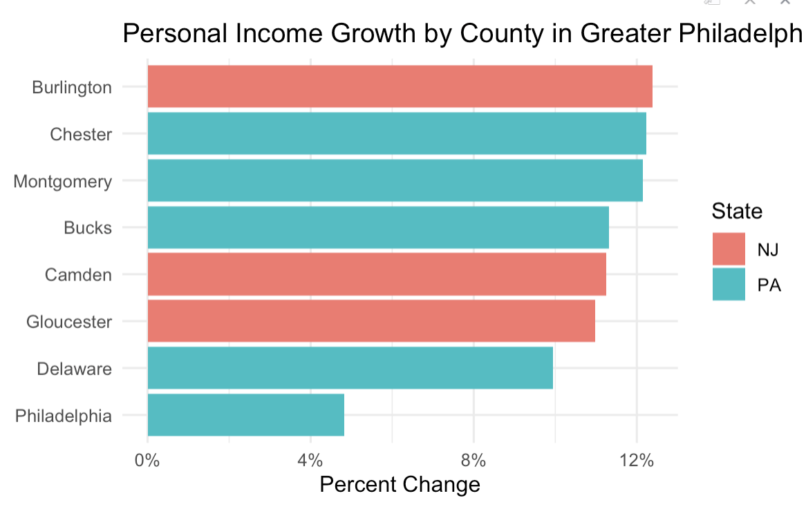

# Pitch Memo

## What is this story about?

Delaware County is the only county in the greater Philadelphia region whose GDP shrank between 2022 and 2024. Manufacturing industry in Delaware County lost more than \$428 million in output, showing a 12% decline. Meanwhile, neighboring counties like Bucks and Burlington saw their manufacturing GDP grow by double digits over the same period.

```{r}
#| label: set-up
#| include: false
#Load libraries
#install.packages("rio")
library(tidyverse)
library(readxl)
library(janitor)
library(rio)
```

```{r}
#Retrieve GDP Data
gdp_county <- read_csv("https://raw.githubusercontent.com/djnf-data-2026/master/refs/heads/main/data/bea_gdp_2024_county_CAGDP1.csv", skip=3) |> 
  clean_names() |> 
    mutate(across(3:5, as.numeric))

#Calculate change 2024 vs 2022; split out state
gdp_county <- gdp_county |> 
  mutate(pct_24_v_22 = (x2024-x2022)/x2022,
          state = str_split_fixed(geo_name, ", ", 2)[, 2],
         county = str_split_fixed(geo_name, ", ", 2)[, 1])  

philly_gdp <- gdp_county |>
  filter(state == "PA" | state == "NJ") |>
  filter(county %in% c("Philadelphia", "Montgomery", 
                        "Bucks", "Chester", 
                        "Delaware", "Gloucester", 
                        "Camden", "Burlington")) |>
  select(county, state, x2022, x2024, pct_24_v_22) |>
  mutate(rank(x2022)) |>
  mutate(rank(x2024)) |>
  arrange(desc(pct_24_v_22))

#Chart: GDP Growth by County
  #AI assisted

ggplot(philly_gdp, aes(x = reorder(county, pct_24_v_22), y = pct_24_v_22, fill = state)) +
  geom_col() +
  coord_flip() +
  scale_y_continuous(labels = scales::percent) +
  labs(
    title = "GDP Growth by County in Greater Philadelphia (2022-2024)",
    x = NULL,
    y = "Percent Change",
    fill = "State"
  ) +
  theme_minimal()

```

> **About the data**
>
> GDP CAGDP1 County gross domestic product (GDP) summary Real Gross Domestic Product (GDP) (Thousands of chained 2017 dollars) [Source Page](https://www.bea.gov/news/2026/gross-domestic-product-county-and-personal-income-county-2024)
>
> And more detail: [GDP by County](https://www.bea.gov/data/gdp/gdp-by-county)

## In one sentence, why tell this story NOW?

The Bureau of Economic Analysis (BEA) released its 2024 county-level GDP data on February 5, 2026, offering the most current picture of how the greater Philadelphia region's economy has shifted.

## Who is your target audience?

Residents and workers in Delaware County and the greater Philadelphia region

## Three people you can interview for this story

1.  Still finding actual person: An economist at the Federal Reserve Bank of Philadelphia specializing in regional labor markets, who could provide context on the broader manufacturing decline across southeastern Pennsylvania.
2.  [Brian C. Eury](https://www.delcopa.org/ida), Chair of Delaware County Industrial Development Authority, who could speak to what industries the county has tried to attract and whether any economic diversification strategies are underway. (610) 566-2225
3.  A representative from the [Delaware County Central Labor Council, AFL-CIO](https://paaflcio.org/delaware-county-afl-cio-council/about-us), (maybe Todd Farally the President? but I haven't find his direct contact info), who could speak to job losses across the county's manufacturing sector

## Potential impact

A sustained decline in Delaware County's manufacturing output likely means fewer stable jobs for working-class residents, reduced tax revenue for local services, and a widening gap between the county and its neighbors.

## What are three things that surprised or interested you about this story?

1.  Delaware County's GDP shrank even as personal income grew by 10%. Residents may be earning more by commuting to jobs elsewhere. ~~(How to explore this with data?)~~

**this headline needs to be fixed – it bleeds off the page – and the screenshot needs cropping on the top**



2.  Philadelphia's manufacturing sector actually fell harder than Delaware County's (14% vs. 12%), but Philadelphia's overall GDP remained positive. Delaware County's economy is far more dependent on manufacturing and has fewer industries to fill the gap.


3.  Between 2015 and 2025, transportation equipment manufacturing, historically the largest employer among all manufacturing sub-sectors, lost nearly 1,600 jobs, a 29% decline.

**this chart doesn't illustrate the decline you describe in point #3. so either revise the chart or the narrative in #3.**

<iframe title="Delaware County&#39;s 10 Largest Manufacturing Sub-sectors by Employment in 2025" aria-label="Bar Chart" id="datawrapper-chart-eIeGS" src="https://datawrapper.dwcdn.net/eIeGS/3/" scrolling="no" frameborder="0" style="border: none;" width="100%" height="500" data-external="1">

</iframe>

<iframe title="Manufacturing Sub-sectors With More Workers in 2025 Compared With 2015" aria-label="Line chart" id="datawrapper-chart-66d8T" src="https://datawrapper.dwcdn.net/66d8T/1/" scrolling="no" frameborder="0" style="border: none;" width="100%" height="800" data-external="1">

**the annotations on this graphic bleed outside of the boundaries so please revise so all of the wording is visible**

</iframe>

<iframe title="Manufacturing Sub-sectors With Less Workers in 2025 Compared in 2015" aria-label="Line chart" id="datawrapper-chart-H3Flo" src="https://datawrapper.dwcdn.net/H3Flo/1/" scrolling="no" frameborder="0" style="border: none;" width="100%" height="800" data-external="1">

</iframe>

## Context: Summarize any previous coverage.

[WHYY reported in 2023](https://whyy.org/articles/manufacturing-downturn-economy-federal-reserve/) that the greater Philadelphia region experienced nine consecutive months of manufacturing slowdown, with factory closures and layoffs in Philadelphia and King of Prussia.

The Federal Reserve Bank of Philadelphia's [May 2026 Manufacturing Business Outlook Survey](https://www.philadelphiafed.org/surveys-and-data/regional-economic-analysis/manufacturing-business-outlook-survey) found that the employment index remained negative for the third time in four months, suggesting the region's manufacturing job losses are ongoing.

According to [Delaware County's official history](https://delcopa.gov/your-county-glance-history), the county has a long history as an industrial hub, home to shipbuilders, locomotive makers, and oil refineries. But the county's manufacturing sector has been shrinking for decades, and the latest BEA data shows it is still losing ground. No reporting has specifically asked why Delaware County has failed to compensate for those losses with growth in other sectors, or what that means for the workers and communities left behind.

## Photos, video, graphics - How will you make this story visual?

Graphics

## What other information do you need to gather?

-   Employment data for Delaware County to understand where workers went as manufacturing shrank, and why personal income continued to rise despite the GDP decline.
-   Population change data would help confirm whether residents are leaving the county.
-   Any specific factory closures during this period?

## Estimated delivery

Data analysis will be complete by June 7. Interviews will wrap up by June 15. A first draft will be ready by June 17.

------------------------------------------------------------------------
